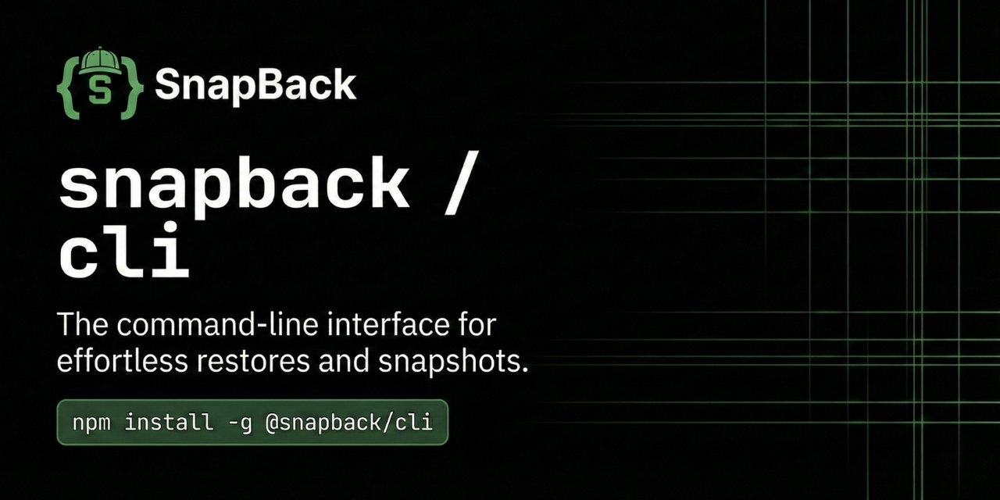

<p align="center">
  
</p>

[](https://www.npmjs.com/package/@snapback/cli)
[](https://www.npmjs.com/package/@snapback/cli)
[](https://github.com/snapback-dev/snapback-cli/blob/main/LICENSE)

AI coding assistants like **Cursor**, **GitHub Copilot**, and **Claude** are incredible—until they're not. One wrong autocomplete can cascade into hours of debugging. Git doesn't help because you haven't committed yet.

**SnapBack is your safety net for AI-native development.**

## Why SnapBack?

| The Problem | The Solution |
|-------------|--------------|
| AI makes a bad change | Automatic snapshots before risky edits |
| You don't notice until later | Risk analysis flags dangerous patterns |
| Git history is clean (no commits yet) | One-click recovery with `snap undo` |
| Same mistake happens again | Learning loop auto-promotes patterns |
| Works in Cursor but not VS Code | Editor-agnostic protection |

### Key Metrics

- ⚡ **<100ms** snapshot creation
- 🎯 **89%** AI change detection accuracy
- 🔒 **Privacy-first** — code never leaves your machine
- 🧠 **Self-improving** — learns from your mistakes automatically

---

## Getting Started

SnapBack has two primary interfaces:

### 🎨 VS Code Extension (Recommended)

The extension provides the best experience with automatic snapshots, visual recovery UI, and real-time risk indicators.

```
ext install MarcelleLabs.snapback-vscode
```

Or search "SnapBack" in the VS Code Extensions marketplace.

[](https://marketplace.visualstudio.com/items?itemName=MarcelleLabs.snapback-vscode)

### 💻 CLI Tool

For terminal workflows, CI/CD integration, and MCP server setup:

```bash
# Install globally
npm install -g @snapback/cli

# Or run without installing
npx @snapback/cli <command>
```

---

## Quick Start

```bash
# Interactive setup wizard (recommended for first-time users)
snap wizard

# Or quick init
snap init

# Analyze a file for risk
snap analyze src/auth.ts

# Create a snapshot before risky changes
snap snapshot -m "Before auth refactor"

# Pre-commit validation
snap check --all

# Something went wrong? Recover instantly
snap undo
```

---

## MCP Integration (Cursor, Claude, Windsurf)

SnapBack includes an MCP (Model Context Protocol) server that lets AI assistants understand your codebase and create checkpoints.

### Quick Setup (Recommended)

The CLI can automatically configure MCP for all detected AI tools:

```bash
# Auto-detect and configure all AI tools
snap tools configure

# Or configure specific tools
snap tools configure --cursor
snap tools configure --claude
snap tools configure --windsurf
```

### Manual Setup

If you prefer manual configuration or the auto-setup doesn't work, add this to your AI tool's MCP config:

#### Option 1: Using npx (Recommended)

```json
{
  "mcpServers": {
    "snapback": {
      "command": "npx",
      "args": [
        "-y",
        "@snapback/cli",
        "mcp",
        "--stdio",
        "--workspace",
        "/absolute/path/to/your/project"
      ],
      "env": {
        "SNAPBACK_API_KEY": "your-api-key-here"
      }
    }
  }
}
```

#### Option 2: Using Global Install

```json
{
  "mcpServers": {
    "snapback": {
      "command": "snap",
      "args": [
        "mcp",
        "--stdio",
        "--workspace",
        "/absolute/path/to/your/project"
      ],
      "env": {
        "SNAPBACK_API_KEY": "your-api-key-here"
      }
    }
  }
}
```

#### Option 3: Using Node Directly

```json
{
  "mcpServers": {
    "snapback": {
      "command": "node",
      "args": [
        "/absolute/path/to/node_modules/@snapback/cli/dist/index.js",
        "mcp",
        "--stdio",
        "--workspace",
        "/absolute/path/to/your/project"
      ],
      "env": {
        "SNAPBACK_API_KEY": "your-api-key-here"
      }
    }
  }
}
```

### Config File Locations

| Tool | Config Path |
|------|-------------|
| **Claude Desktop** | `~/Library/Application Support/Claude/claude_desktop_config.json` (macOS) |
| **Cursor** | `~/.cursor/mcp.json` |
| **Windsurf** | `~/.windsurf/mcp.json` |
| **Continue** | `~/.continue/config.json` |

### Workspace Requirements

The MCP server requires at least one of these markers in your project:

- `.git/` directory
- `package.json` file
- `.snapback/` directory

### Verify Setup

```bash
# Check which tools are configured
snap tools status

# Validate configurations
snap tools validate

# Repair broken configs
snap tools repair
```

### Available MCP Tools

Once configured, your AI assistant can use:

| Tool | Description |
|------|-------------|
| `snapback.get_context` | Understand your codebase |
| `snapback.analyze_risk` | Assess change risks |
| `snapback.create_checkpoint` | Create safety snapshots (Pro) |
| `snapback.restore_checkpoint` | Recover from mistakes (Pro) |

---

## How It Compares

### vs. Git Stash

| Feature | Git Stash | SnapBack |
|---------|-----------|----------|
| Automatic snapshots | ❌ Manual | ✅ On save |
| AI change detection | ❌ | ✅ Cursor, Copilot, Claude |
| Risk analysis | ❌ | ✅ Per-file scoring |
| Recovery UX | 😬 Arcane | ✅ `snap undo` |

### vs. Cursor's Built-in Checkpoints

| Feature | Cursor | SnapBack |
|---------|--------|----------|
| Works in any editor | ❌ | ✅ |
| Risk scoring | ❌ | ✅ |
| Learning from mistakes | ❌ | ✅ |
| CLI access | ❌ | ✅ |
| MCP integration | ❌ | ✅ |

### vs. Static Analysis (SonarQube, CodeClimate)

| Feature | Static Analysis | SnapBack |
|---------|-----------------|----------|
| Local-first | ❌ Cloud | ✅ |
| AI source detection | ❌ | ✅ |
| Recovery/snapshots | ❌ | ✅ |
| Personal learning | ❌ | ✅ |

---

## Commands

### Core Commands

| Command | Description |
|---------|-------------|
| `snap init` | Initialize `.snapback/` in your workspace |
| `snap snapshot` | Create a snapshot of current state |
| `snap analyze <file>` | Risk analysis for a file |
| `snap check` | Pre-commit validation |
| `snap list` | List all snapshots |
| `snap undo` | Revert the last destructive operation |
| `snap status` | Show workspace status |
| `snap fix` | Fix common issues |

### Authentication Commands

| Command | Description |
|---------|-------------|
| `snap login` | OAuth login flow |
| `snap logout` | Clear credentials |
| `snap whoami` | Show current user |

### Intelligence Commands

| Command | Description |
|---------|-------------|
| `snap context [task]` | Get relevant patterns before starting work |
| `snap validate <file>` | Run 7-layer validation pipeline |
| `snap validate --all` | Validate all staged files |
| `snap stats` | Show learning statistics |

### Learning Commands

| Command | Description |
|---------|-------------|
| `snap learn record` | Record a new learning |
| `snap learn list` | List recorded learnings |
| `snap patterns report` | Report a violation (auto-promotes at 3×) |
| `snap patterns summary` | Show violation patterns |

### Protection Commands

| Command | Description |
|---------|-------------|
| `snap protect add <file>` | Add file to protection list |
| `snap protect remove <file>` | Remove from protection |
| `snap protect list` | List protected files |
| `snap session start` | Start a coding session |
| `snap session end` | End current session |
| `snap watch` | Continuous file watching |

### MCP & Tools Commands

| Command | Description |
|---------|-------------|
| `snap mcp --stdio` | Start MCP server for AI assistant integration |
| `snap tools configure` | Auto-setup MCP for detected AI tools |
| `snap tools configure --cursor` | Configure for Cursor only |
| `snap tools configure --claude` | Configure for Claude Desktop only |
| `snap tools configure --windsurf` | Configure for Windsurf only |
| `snap tools configure --npm` | Use npx mode (recommended for npm users) |
| `snap tools configure --dev` | Use local development mode |
| `snap tools status` | Check MCP configuration status |
| `snap tools validate` | Validate MCP configurations |
| `snap tools repair` | Repair broken MCP configurations |

### Daemon Commands

| Command | Description |
|---------|-------------|
| `snap daemon start` | Start SnapBack daemon |
| `snap daemon stop` | Stop SnapBack daemon |
| `snap daemon status` | Check daemon status |
| `snap daemon restart` | Restart daemon |

### Utility Commands

| Command | Description |
|---------|-------------|
| `snap wizard` | Interactive first-run setup |
| `snap doctor` | Diagnostics and health check |
| `snap doctor --fix` | Auto-fix detected issues |
| `snap upgrade` | Check for CLI updates |
| `snap config list` | List configuration values |
| `snap config get <key>` | Get a specific config value |
| `snap config set <key> <value>` | Set a configuration value |
| `snap alias list` | List command shortcuts |
| `snap alias set <name> <cmd>` | Create a command alias |
| `snap interactive` | Guided TUI workflow |

---

## The 7-Layer Validation Pipeline

When you run `snap validate` or `snap check`, SnapBack analyzes your code across seven layers:

| Layer | What It Checks |
|-------|----------------|
| **Syntax** | Bracket matching, semicolons |
| **Types** | `any` usage, `@ts-ignore`, non-null assertions |
| **Tests** | Vague assertions, 4-path coverage |
| **Architecture** | Layer boundaries, service bypass |
| **Security** | Hardcoded secrets, `eval()` |
| **Dependencies** | Deprecated packages |
| **Performance** | `console.log`, sync I/O, `await` in loops |

```bash
# Validate a single file
snap validate src/auth.ts

# Validate all staged files (quiet mode for CI)
snap validate --all --quiet

# JSON output for automation
snap validate --all --json
```

---

## Auto-Promotion: Learning from Mistakes

SnapBack tracks violations and automatically promotes patterns:

| Occurrence | Action |
|------------|--------|
| **1×** | Stored in `violations.jsonl` |
| **3×** | Auto-promoted to `workspace-patterns.json` |
| **5×** | Marked for automated detection |

```bash
# Report a violation manually
snap patterns report

# View promotion status
snap patterns summary
```

---

## World-Class CLI UX

SnapBack implements best practices from GitHub CLI, Vercel CLI, and Stripe CLI.

### Smart Error Messages

```
╭───────────────────────────────────────────────────╮
│ [ERR_NOT_INIT] Workspace Not Initialized          │
│                                                   │
│ This workspace hasn't been set up for SnapBack   │
│                                                   │
│ 💡 Suggestion:                                    │
│    Initialize SnapBack in this directory         │
│                                                   │
│ 📋 Try running:                                   │
│    $ snap init                                    │
╰───────────────────────────────────────────────────╯
```

### Typo Detection

```
$ snap statis
╭────────────────────────────────────────╮
│ Unknown command: statis                │
│                                        │
│ Did you mean:                          │
│   $ snap status                        │
│   $ snap stats                         │
╰────────────────────────────────────────╯
```

### Command Aliases

```bash
# Create shortcuts
snap alias set st status
snap alias set ss snapshot

# Use them
snap st
snap ss -m "checkpoint"
```

### Dry-Run Mode

```bash
snap init --dry-run
# Shows what will be created without making changes

snap tools configure --dry-run
# Shows what MCP config would be written
```

### Shell Completions

```bash
# Bash
eval "$(snap completion bash)"

# Zsh
eval "$(snap completion zsh)"

# Fish
snap completion fish | source
```

Completion scripts are also available at:

- `resources/completions/snap.bash`
- `resources/completions/snap.zsh`
- `resources/completions/snap.fish`

---

## Pre-Commit Hook Integration

### Git Hook

```bash
#!/bin/sh
# .git/hooks/pre-commit
npx @snapback/cli check --snapshot --quiet
```

### Lefthook

```yaml
# .lefthook.yml
pre-commit:
  commands:
    snapback:
      run: npx @snapback/cli check --all --quiet
```

### GitHub Actions

```yaml
- name: Validate code
  run: npx @snapback/cli validate --all --json > validation.json

- name: Check for risky changes
  run: npx @snapback/cli check --quiet
```

---

## Configuration

### Workspace Structure

After `snap init`:

```
your-project/
├── .snapback/
│   ├── config.json              # Workspace config
│   ├── vitals.json              # Health metrics
│   ├── constraints.md           # Your rules (optional)
│   ├── patterns/
│   │   ├── violations.jsonl     # Tracked violations
│   │   └── workspace-patterns.json
│   └── learnings/
│       └── user-learnings.jsonl
└── .snapbackrc                  # CLI config
```

### `.snapbackrc` Options

```json
{
  "protectionLevel": "warn",
  "autoSnapshot": true,
  "riskThreshold": 5.0,
  "ignorePaths": ["node_modules", "dist", ".git"]
}
```

---

## Diagnostics

```bash
$ snap doctor

🏥 SnapBack Diagnostics

  ✓ Node.js version      v20.10.0
  ✓ CLI installation     v1.0.11 (latest)
  ✓ Global directory     ~/.snapback/ exists
  ✓ Authentication       Logged in as @user
  ✓ Workspace            .snapback/ initialized
  ✓ MCP tools            3 tools configured
  ✓ Git repository       Clean
  ✓ Network              API reachable

  All checks passed!
```

---

## Exit Codes

| Code | Meaning |
|------|---------|
| `0` | Success |
| `1` | Issues found (validation failed, risky changes) |

---

## Related Packages

### Open Source (npm)

| Package | Description |
|---------|-------------|
| [@snapback-oss/sdk](https://www.npmjs.com/package/@snapback-oss/sdk) | Production-ready SDK for code safety systems |
| [@snapback-oss/contracts](https://www.npmjs.com/package/@snapback-oss/contracts) | Type definitions and schemas |
| [@snapback-oss/infrastructure](https://www.npmjs.com/package/@snapback-oss/infrastructure) | Storage and logging utilities |
| [@snapback-oss/events](https://www.npmjs.com/package/@snapback-oss/events) | Event definitions and handlers |

### VS Code Extension

| Package | Description |
|---------|-------------|
| [MarcelleLabs.snapback-vscode](https://marketplace.visualstudio.com/items?itemName=MarcelleLabs.snapback-vscode) | VS Code extension with visual UI |

---

## Get an API Key

Unlock Pro features like checkpoint creation and restoration:

👉 **[console.snapback.dev/settings/api-keys](https://console.snapback.dev/settings/api-keys)**

---

## License

[Apache-2.0](https://github.com/snapback-dev/snapback-cli/blob/main/LICENSE)

---

<p align="center">
  <strong>Stop losing work to AI mistakes.</strong><br>
  <a href="https://snapback.dev">Website</a> ·
  <a href="https://docs.snapback.dev">Docs</a> ·
  <a href="https://console.snapback.dev">Dashboard</a> ·
  <a href="https://discord.gg/B4BXeYkE2F">Discord</a>
</p>
